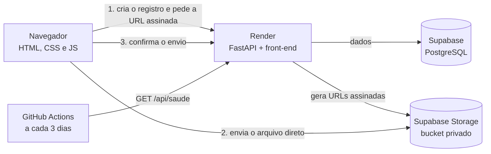
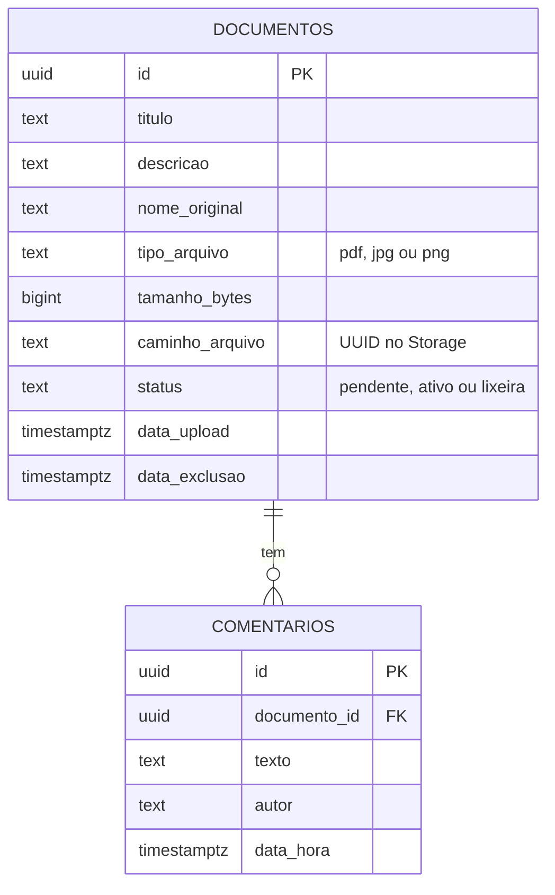

# Sistema de Gestão de Documentos

Aplicação web para **enviar documentos (PDF, JPG ou PNG)**, consultá-los em uma lista com **visualizar e baixar**, e manter um **histórico de comentários** por documento. Desenvolvida como case técnico do processo seletivo de Estagiário Desenvolvedor Full Stack da Resende Mori Hutchison Advocacia (RMH), com foco em simplicidade de uso e em tratar bem as situações de erro.

## Acesse

**https://sistema-gestao-documentos.onrender.com** (sem login)

> O plano gratuito da hospedagem "dorme" após alguns minutos sem uso. **A primeira abertura pode levar cerca de 1 minuto**; depois disso o sistema responde normalmente. O sistema já vem com 8 documentos públicos na lista (projetos de lei da Câmara dos Deputados) e 4 documentos fictícios de teste na Lixeira, para demonstrar a restauração.

## Tecnologias

| Camada | Tecnologia | Por quê |
|---|---|---|
| Front-end | HTML, CSS e JavaScript puros | Exigência da prova; sem framework nem etapa de build, fácil de ler |
| Back-end | Python + FastAPI | Rotas simples, validação clara e testes rápidos |
| Banco de dados | Supabase (PostgreSQL) | Relacionamento entre documentos e comentários, gratuito |
| Arquivos | Supabase Storage (bucket privado) | Armazenamento em nuvem; acesso só por links temporários |
| Hospedagem | Render (plano gratuito) | Um único serviço serve a API e o front-end, com URL pública |
| Automação | GitHub Actions | Rotina que evita a pausa do Supabase gratuito |
| Versionamento | Git e GitHub | Histórico de commits pequenos e descritivos |

## Funcionalidades

**Requisitos da prova**
- Enviar PDF, JPG ou PNG, com título e descrição opcional; arquivo armazenado e dados salvos no banco.
- Listar documentos com título e data de upload, com ações de **visualizar** (nova aba) e **baixar** (com o nome original).
- Inserir e listar **comentários** por documento, vinculados ao documento correto e com data e hora.
- Sem login, autenticação ou controle de acesso.

**Casos de borda tratados** (testes em [docs/testes-casos-de-borda.md](docs/testes-casos-de-borda.md))
- **Tamanho:** máximo de 10 MB, conferido em três camadas (navegador, API e bucket).
- **Tipos:** só PDF, JPG e PNG. Confere extensão, tipo informado e o **conteúdo real** do arquivo; recusa arquivo vazio; o arquivo é salvo com nome gerado (UUID) e o nome original fica no banco.
- **Falhas:** nunca fica registro pela metade (o documento nasce `pendente` e só vira `ativo` depois de conferido). Se a conexão cair, o formulário é mantido e há "Tentar novamente". Erros técnicos viram mensagens amigáveis.
- **Espaço:** cota de 900 MB (ativos + lixeira), verificada **antes** do upload.
- **Comentário em documento excluído:** o documento na lixeira não aceita novos comentários; a exclusão definitiva apaga os comentários junto, avisando a quantidade.
- **Recuperação:** lixeira com "Restaurar" e "Excluir definitivamente"; limpeza automática após 30 dias.

**Extras implementados**
- Barra de uso do armazenamento, com aviso a partir de 80%.
- Nome opcional do autor no comentário ("Anônimo" quando não informado).
- Documentos de exemplo pré-carregados por script (`scripts/seed.py`).
- Área de soltar arquivo, destaque do documento recém-enviado e interface com acessibilidade (foco visível, leitores de tela, respeito a "reduzir movimento").

## Como executar localmente

Pré-requisitos: **Python 3.13 ou superior** (testado com 3.13 e 3.14), **Git** e uma conta gratuita no [Supabase](https://supabase.com).

1. **Clone e prepare o ambiente**
   ```bash
   git clone https://github.com/lannacsoares/sistema-gestao-documentos.git
   cd sistema-gestao-documentos
   python -m venv .venv
   # Windows: .venv\Scripts\activate      Linux/macOS: source .venv/bin/activate
   pip install -r requirements.txt
   ```
2. **Banco e bucket:** crie um projeto no Supabase e, em **SQL Editor**, execute o conteúdo de `db/schema.sql`. Ele cria as tabelas, a função de cota e o bucket privado `documentos`.
3. **Variáveis de ambiente:** copie `.env.example` para `.env` e preencha `SUPABASE_URL` e `SUPABASE_SERVICE_ROLE_KEY` (no painel do Supabase: **Project Settings → API**). A chave é **secreta**: fica só no `.env` (que não vai para o Git), nunca no front-end.
4. **Rodar:**
   ```bash
   uvicorn app.main:app --reload
   ```
   Abra http://localhost:8000. Em desenvolvimento a própria API serve o front-end (`public/`); a documentação interativa da API fica em http://localhost:8000/api/docs.
5. **(Opcional) Popular os exemplos:**
   ```bash
   pip install -r requirements-dev.txt
   python scripts/gerar_exemplos.py
   python scripts/seed.py
   ```
6. **Testes:** `pytest` (não precisa de `.env` nem de Supabase)

## Observações e limitações conhecidas

- **Arquivos ficam no Supabase Storage (nuvem), não em uma pasta local.** A prova menciona armazenamento local, mas para ter um deploy público o disco do servidor gratuito é temporário e seria apagado; por isso os arquivos ficam no bucket.
- **Sem login** (conforme a prova): qualquer pessoa com o link vê e pode excluir documentos. Use apenas documentos **fictícios ou públicos**. Se os exemplos forem excluídos, `python scripts/seed.py` os restaura (os públicos voltam para a lista; os fictícios, para a lixeira).
- **Upload direto ao Storage:** o navegador envia o arquivo direto ao Storage por uma URL assinada e temporária; o arquivo nunca passa pela API. Isso mantém a API leve e o envio rápido.
- **Plano gratuito do Supabase:** 1 GB de arquivos e 500 MB de banco (a cota de trabalho do sistema é 900 MB). O Supabase pausa projetos com pouca atividade após 7 dias; uma rotina no GitHub Actions ([keepalive.yml](.github/workflows/keepalive.yml)) consulta o sistema a cada 3 dias. Se o projeto pausar mesmo assim, use **Supabase Dashboard → Restore/Resume project**.
- **Partida a frio:** no plano gratuito do Render, a primeira requisição após um período parado pode levar cerca de 1 minuto.
- **Limites:** 10 MB por arquivo; lixeira de 30 dias, com limpeza feita ao abrir a lixeira. Os valores são configuráveis por variável de ambiente.
- **Duplicados:** enviar o mesmo arquivo duas vezes cria dois registros independentes (não é tratado como erro).
- **Melhorias futuras:** categoria de documento, busca e filtro na lista, e paginação quando houver muitos documentos.

## Arquitetura



O arquivo vai direto do navegador ao Storage; a API só cria o registro, confere o resultado (tamanho e conteúdo real) e ativa o documento. Para visualizar ou baixar, a API gera um link temporário.

## Modelo de dados



Comentários são apagados em cascata quando o documento é excluído definitivamente. A referência completa das rotas está em [docs/api.md](docs/api.md).

## Exemplos e testes

- **Exemplos:** documentos fictícios gerados por script (`scripts/gerar_exemplos.py`, todos marcados "DOCUMENTO FICTÍCIO") e PDFs públicos de projetos de lei da Câmara dos Deputados. A origem de cada um está em [exemplos/publicos/ORIGEM.md](exemplos/publicos/ORIGEM.md).
- **Testes automatizados:** `pytest` cobre as validações (título, tamanho, tipo, conteúdo real, cota, comentário e prazo da lixeira).
- **Casos de borda:** resultados registrados em [docs/testes-casos-de-borda.md](docs/testes-casos-de-borda.md). O script `scripts/testar_deploy.py` repete pela API pública as verificações que não dependem do navegador.

## Estrutura de pastas

```
app/          back-end FastAPI (rotas, validadores, acesso ao Supabase e ao Storage)
public/       front-end estático (páginas, CSS, JavaScript)
db/           schema.sql (tabelas, função de cota e bucket)
scripts/      gerar_exemplos.py, seed.py, testar_deploy.py
exemplos/     arquivos de exemplo e de teste (fictícios e públicos)
tests/        testes automatizados (pytest)
docs/         API, testes de casos de borda e planejamento por fases
.github/      rotina anti-pausa (keepalive.yml)
render.yaml   configuração da hospedagem
```

**Commits:** pequenos e em português, com prefixo `feat:`, `fix:`, `docs:`, `test:`, `chore:` ou `refactor:`.
